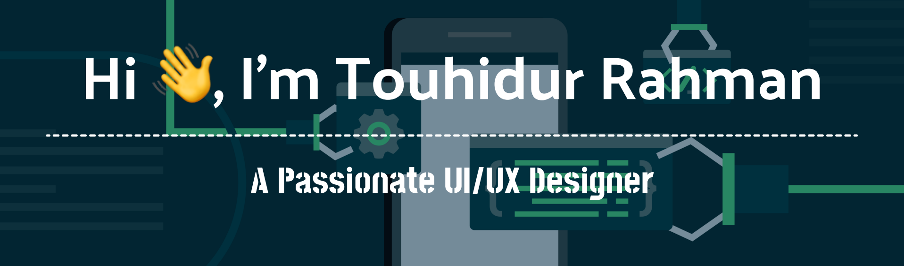
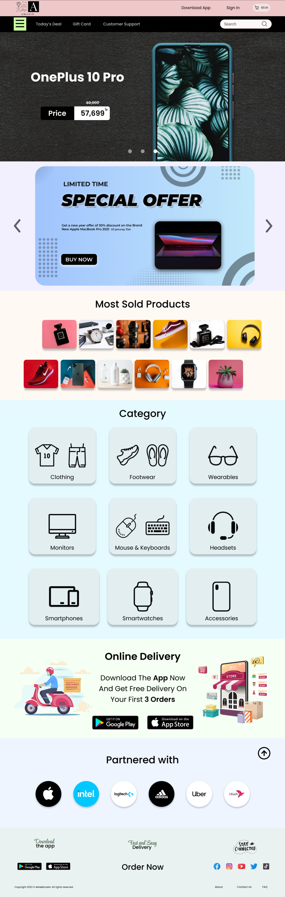
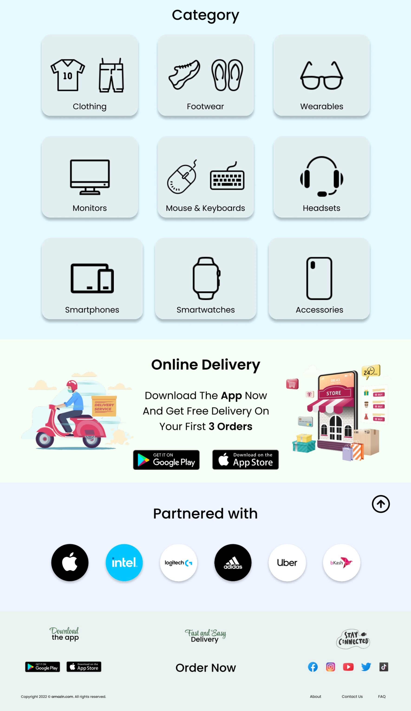
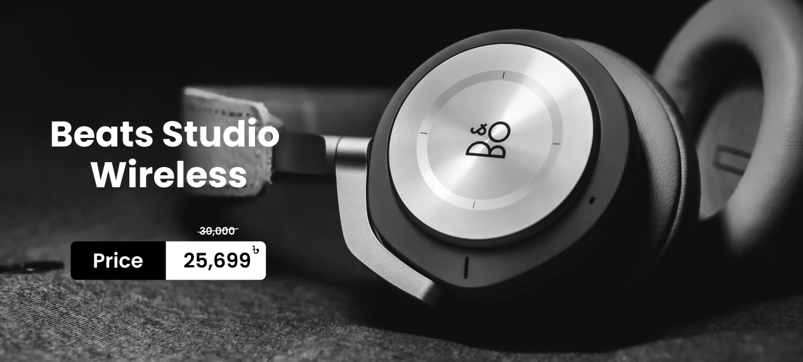
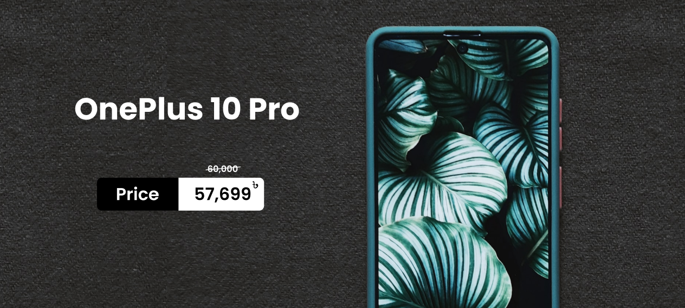

 

- 🔭 I’m currently working on **UI/UX & Web design with Figma**

- 🌱 I’ve recently started learning **Unity and Unreal engine**

- 👨‍💻 All of my projects are available at :

- 📫  How to reach me :   - rahmantouhid@gmail.com 

- 📄  Know about my experiences :  

<h3 align="left">Languages and Tools:</h3>

              

  
  

  
<h1 align="center">Projects</h1>

  
<h2>1. E-commerce Website UI Design</h2>
<h6>Click on the project screen-shot to see the LIVE DEMO 👇🏻👇🏽</h6>

&nbsp;&nbsp;&nbsp;&nbsp;&nbsp;&nbsp;&nbsp;&nbsp;&nbsp;
&nbsp;&nbsp;&nbsp;&nbsp;&nbsp;&nbsp;&nbsp;&nbsp;&nbsp;

   
<h2>2. Chef's Cuisine Website UI Design</h2>
<h6>Click on the project screen-shot to see the LIVE DEMO 👇🏻👇🏽</h6>

</a>&nbsp;&nbsp;&nbsp;
&nbsp;&nbsp;&nbsp;

   
<h2>3. Apple Landing Page Design</h2>

<h6>Click on the project screen-shot to see the LIVE DEMO 👇🏻👇🏽</h6>

   
<h2>4. Animated Webpage Design</h2>
 
<h3>Parallax Effect</h3>
<h6>Click on the project screen-shot to see the LIVE DEMO 👇🏻👇🏽</h6>

&nbsp;&nbsp;&nbsp;

   
<h3>Slide Effect</h3>
<h6>Click on the project screen-shot to see the LIVE DEMO 👇🏻👇🏽</h6>

&nbsp;&nbsp;&nbsp;

   
<h2>5. Dashboard Design (Dark Mode)</h2>
<h6>Click on the project screen-shot to see the LIVE DEMO 👇🏻👇🏽</h6>
&nbsp;&nbsp;&nbsp;

   
<h2>6. Promotional/Sale Banner Design</h2>
<h6>Click on the project screen-shot to see the LIVE DEMO 👇🏻👇🏽</h6>
&nbsp;

&nbsp;&nbsp;&nbsp;

 &nbsp;&nbsp;&nbsp;

 &nbsp;&nbsp;&nbsp;

 &nbsp;&nbsp;&nbsp;

 &nbsp;&nbsp;&nbsp;

 

