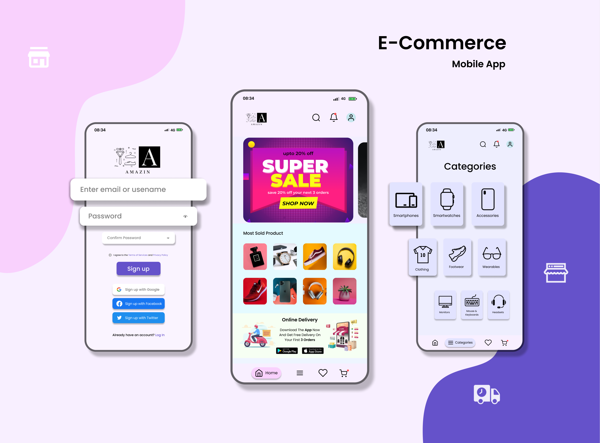
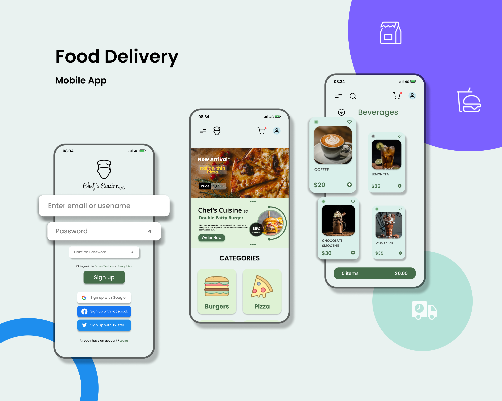
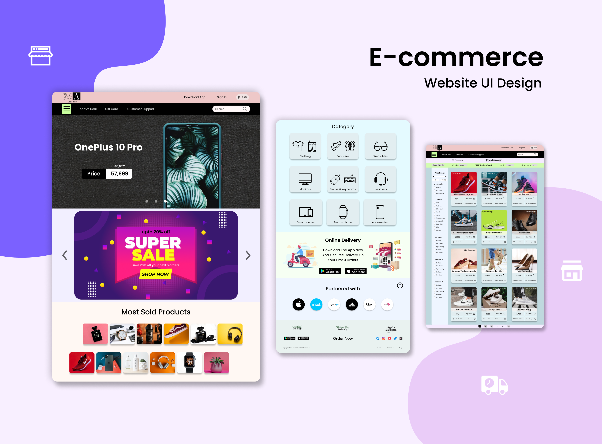
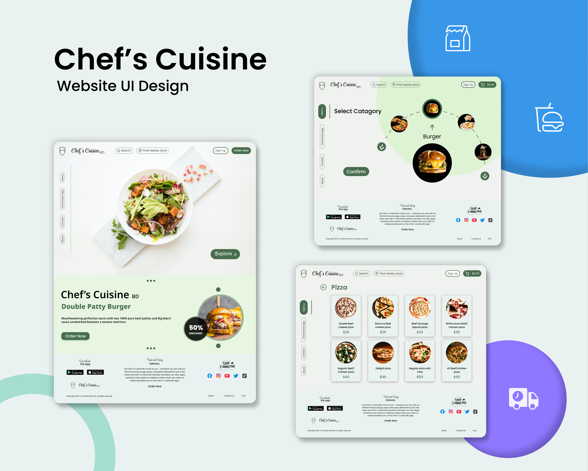

 

 

- 🔭 I’m currently working on <i><b>UI/UX & Web design with Figma</b></i>

- 🌱 I’ve recently started learning <i><b>Unity and Unreal engine</i></b>

- 👨‍💻 All of my projects are available at :
&nbsp;  &nbsp;  &nbsp; 

- 📫  How to reach me :  &nbsp; <i> <b>- rahmantouhid@gmail.com </b></i>

- 📄  Know about my experiences :  &nbsp; 
 
<h3 align="left">Languages and Tools:</h3> 

 &nbsp; &nbsp;  &nbsp;  &nbsp;  &nbsp;  &nbsp;  &nbsp;  &nbsp;  &nbsp;  &nbsp;  &nbsp;  &nbsp; &nbsp;  

  
<h3 align="left">My Resume:</h3>
<h5>Click on the download button to see the full resume 👉🏻👇🏻</h5>

 
 
  
<h1 align="center">Projects</h1>

 
  
<h2>1. E-commerce App UI Design</h2>
<h6>Click on the project screen-shots to see the LIVE DEMO 👇🏻👇🏽</h6>

   
<h2>2. Chef's Cuisine Delivery App UI Design</h2>
<h6>Click on the project screen-shots to see the LIVE DEMO 👇🏻👇🏽</h6>

  
<h2>3. E-commerce Website UI Design</h2>
<h6>Click on the project screen-shots to see the LIVE DEMO 👇🏻👇🏽</h6>

   
<h2>4. Chef's Cuisine Website UI Design</h2>
<h6>Click on the project screen-shots to see the LIVE DEMO 👇🏻👇🏽</h6>

   
<h2>5. Apple Landing Page Design</h2>

<h6>Click on the project screen-shots to see the LIVE DEMO 👇🏻👇🏽</h6>

   
<h2>6. Animated Webpage Design</h2>

<h3>Parallax Effect</h3>
<h6>Click on the project screen-shots to see the LIVE DEMO 👇🏻👇🏽</h6>

   
<h3>Sliding Effect</h3>
<h6>Click on the project screen-shots to see the LIVE DEMO 👇🏻👇🏽</h6>

   
<h2>7. Dashboard Design (Dark Mode)</h2>
<h6>Click on the project screen-shots to see the LIVE DEMO 👇🏻👇🏽</h6>

   
<h2>8. Promotional/Sale Banner Design</h2>
<h6>Click on the project screen-shots to see the Full Detailed Images 👇🏻👇🏽</h6>

 &nbsp;&nbsp;&nbsp;

 &nbsp;&nbsp;&nbsp;

 &nbsp;&nbsp;&nbsp;

 

