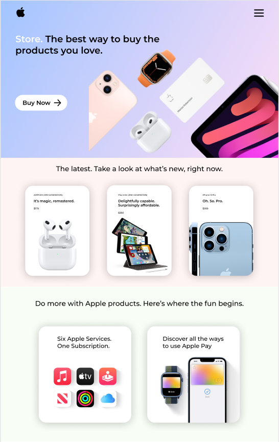
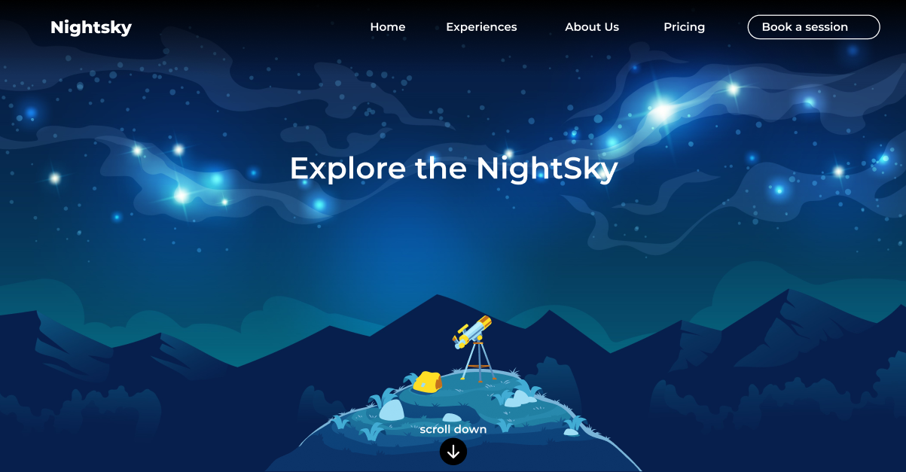
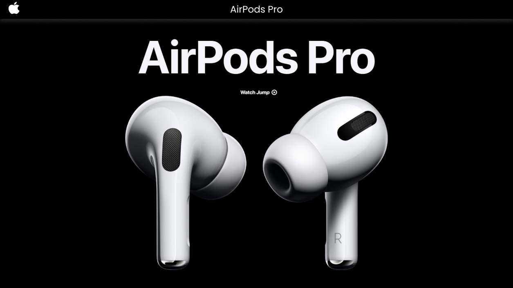
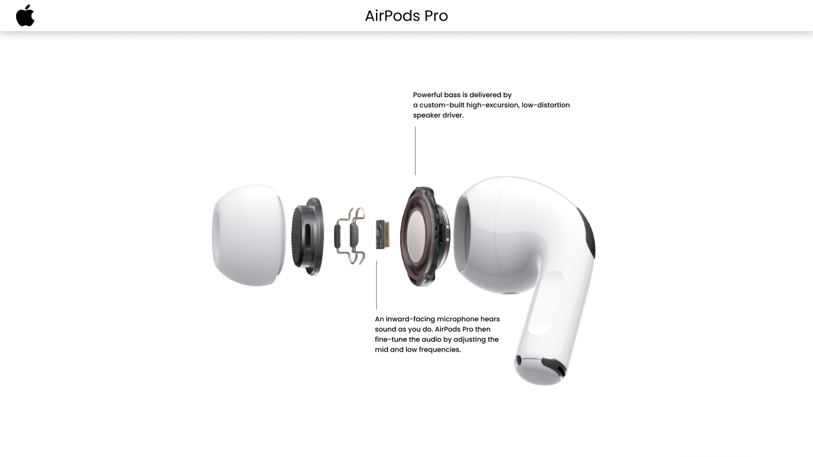
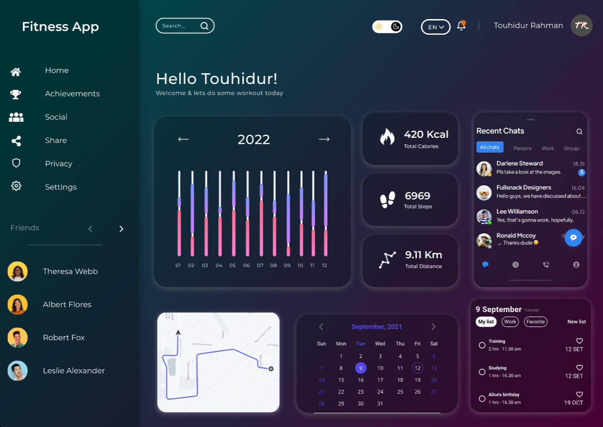
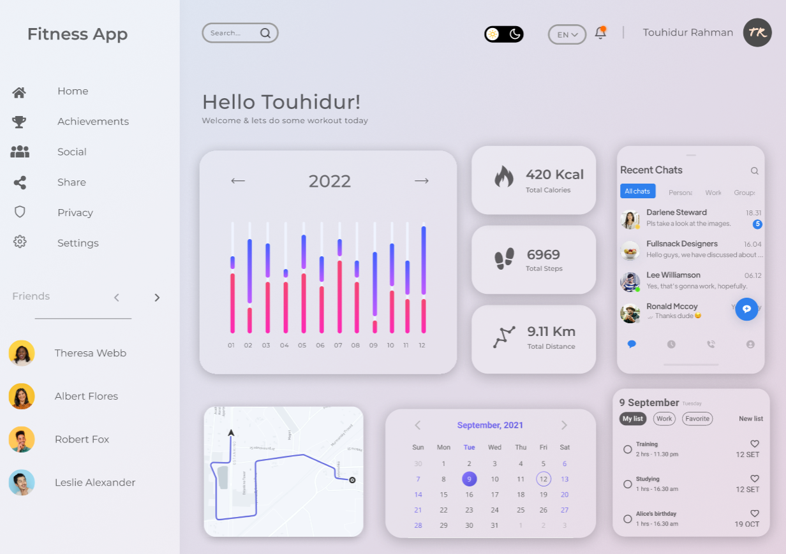
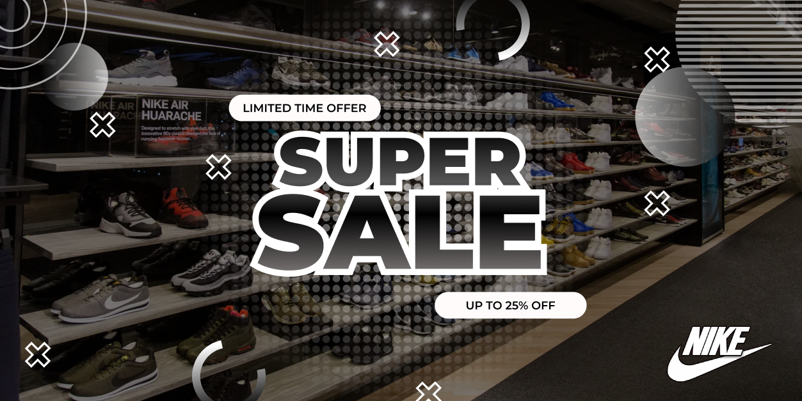
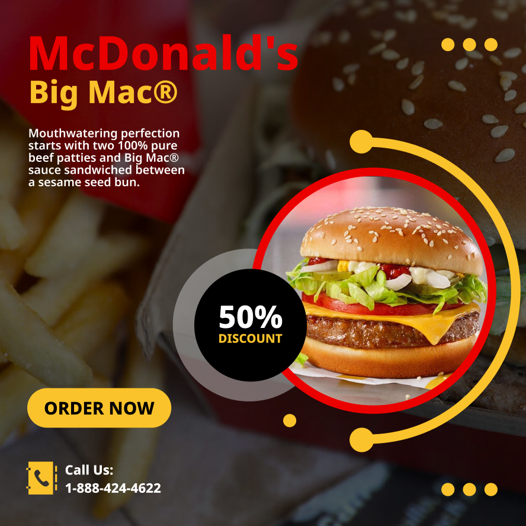

<h1 align="center">Hi 👋, I'm Touhidur Rahman</h1>
<h3 align="center">A Passionate UI/UX Designer</h3>

  

- 🔭 I’m currently working on **UI/UX design with figma**

- 🌱 I’m currently learning **Unity and Unreal engine**

- 👨‍💻 All of my projects are available at [https://github.com/rahmantouhid-cse](https://github.com/rahmantouhid-cse)

- 📫 How to reach me **rahmantouhid@gmail.com**

- 📄 Know about my experiences [https://www.linkedin.com/in/touhidur-rahman-548021196/](https://www.linkedin.com/in/touhidur-rahman-548021196/)

<h3 align="left">Connect with me:</h3>

<h3 align="left">Languages and Tools:</h3>

              

&nbsp;

<h3>Projects </h3>

<h1>1. Chef's Cuisine Website UI</h1>

<h3>Click on the project screen-shot to see the LIVE DEMO 👇🏻👇🏽</h3>

&nbsp;&nbsp;&nbsp;&nbsp;&nbsp;&nbsp;&nbsp;&nbsp;&nbsp;&nbsp;&nbsp;&nbsp;&nbsp;&nbsp;&nbsp;&nbsp;&nbsp;&nbsp;&nbsp;&nbsp;&nbsp;&nbsp;&nbsp;&nbsp;&nbsp;&nbsp;&nbsp;&nbsp;&nbsp;&nbsp;&nbsp;&nbsp;&nbsp;&nbsp;&nbsp;&nbsp;&nbsp;&nbsp;&nbsp;&nbsp;&nbsp;&nbsp;&nbsp;&nbsp;&nbsp;&nbsp;&nbsp;&nbsp;&nbsp;&nbsp;
 

<h1>2. Apple Landing Page</h1>

<h3>Click on the project screen-shot to see the LIVE DEMO 👇🏻👇🏽</h3>

<h1>3. Animated Webpage</h1>
<h2>Parallax Effect</h2>
<h3>Click on the project screen-shot to see the LIVE DEMO 👇🏻👇🏽</h3>

<h2>Slide In Effect</h2>
<h3>Click on the project screen-shot to see the LIVE DEMO 👇🏻👇🏽</h3>

<h1>4. Dashboard Dark Mode Design</h1>
<h3>Click on the project screen-shot to see the LIVE DEMO 👇🏻👇🏽</h3>

<h1>5. Sale/Offer Banner Design</h1>
<h3>Click on the project screen-shot to see the LIVE DEMO 👇🏻👇🏽</h3>

